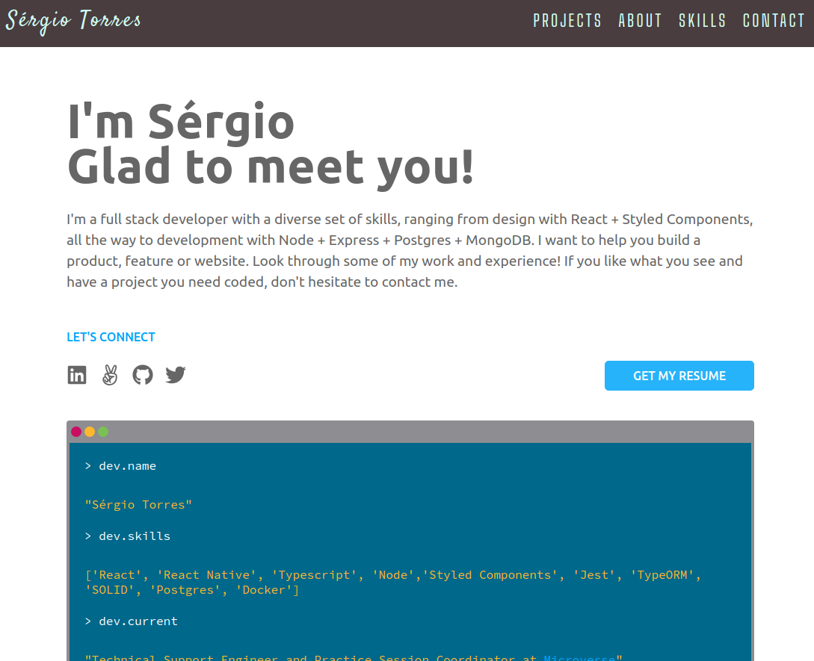

[![Contributors][contributors-shield]][contributors-url]
[![Forks][forks-shield]][forks-url]
[![Stargazers][stars-shield]][stars-url]
[![Issues][issues-shield]][issues-url]

<!-- PROJECT LOGO -->
<br />
<p align="center">
    

  <h3 align="center">Portifolio</h3>

  <p align="center">
    My personal portifolio
    <br />
    <a href="https://www.torres-ssf.com/">View Page</a>
    ·
    <a href="https://github.com/Torres-ssf/personal-portifolio/issues">Report Bug</a>
  </p>
</p>

<!-- TABLE OF CONTENTS -->

## Table of Contents

- [About the Project](#about-the-project)
  - [Live Version](#live)
  - [Built With](#built-with)
- [Getting Started](#getting-started)
  - [Prerequisites](#prerequisites)
  - [Installation](#installation)
- [Usage](#usage)
- [Authors](#authors)
- [Contributing](#contributing)
- [License](#license)

<!-- ABOUT THE PROJECT -->

## About The Project



My personal portifolio.

## Live

Click [ here ](https://www.torres-ssf.com/) for a live version of the app.


### Built With

The project was built using the following languages stacks:

- [React](https://github.com/facebook/react)
- Typescript
- [Styled-Components](https://styled-components.com/)
- [React Icons](https://react-icons.github.io/react-icons/)
- [Polished](https://github.com/styled-components/polished)

<!-- GETTING STARTED -->

## Getting Started

To get a local copy up and running follow these simple example steps.

### Prerequisites

- Git
- Node
- NPM

### Installation

1. Clone the repo

```sh
git clone https://github.com/Torres-ssf/personal-portifolio/
```

2. CD into the project root directory

```sh
cd personal-portifolio/
```

3. Install npm packages

```sh
yarn
```

## Usage

### Used scripts

In the project directory, you can run:

```JS
yarn start
```
Runs the app in the development mode.<br />

```JS
http//localhost:3000
```

## Authors

👤 **Author1**

- Github: [@Torres-ssf](https://github.com/Torres-ssf)
- Linkedin: [torres-ssf](https://www.linkedin.com/in/torres-ssf/)
- AngelList: [torres-ssf](https://angel.co/u/torres-ssf/)
- Twitter: [@torres_ssf](https://twitter.com/torres_ssf)

## 🤝 Contributing

Contributions are what make the open source community such an amazing place to be learn, inspire, and create. Any contributions you make are **greatly appreciated**.

1. Fork the Project
2. Create your Feature Branch (`git checkout -b feature/NewFeature`)
3. Commit your Changes (`git commit -m 'Add some NewFeature'`)
4. Push to the Branch (`git push origin feature/NewFeature`)
5. Open a Pull Request

## Show your support

Give a ⭐️ if you like this project!

## 📝 License

This project is [MIT](LICENSE.md) licensed.

[contributors-shield]: https://img.shields.io/github/contributors/Torres-ssf/personal-portifolio.svg?style=flat-square
[contributors-url]: https://github.com/Torres-ssf/personal-portifolio/graphs/contributors
[forks-shield]: https://img.shields.io/github/forks/Torres-ssf/personal-portifolio.svg?style=flat-square
[forks-url]: https://github.com/Torres-ssf/personal-portifolio/network/members
[stars-shield]: https://img.shields.io/github/stars/Torres-ssf/personal-portifolio.svg?style=flat-square
[stars-url]: https://github.com/Torres-ssf/personal-portifolio/stargazers
[issues-shield]: https://img.shields.io/github/issues/Torres-ssf/personal-portifolio.svg?style=flat-square
[issues-url]: https://github.com/Torres-ssf/personal-portifolio/issues
